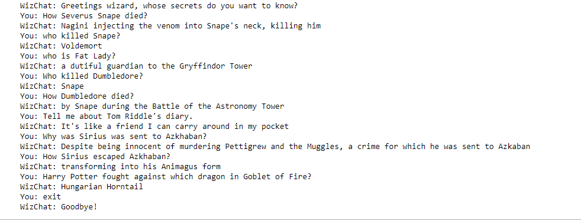

# WizChat-A-chatbot-inspired-by-Harry-Potter-series-

WizChat answers all your queries about any of the 930 characters in the Harry Potter series

The chatbot was created using open source HuggingFaceEmbeddings, Facebook AI similarity search (FAISS), and LLM model ‘google/flan-t5-large’. It's not as good as OpenAI, but I wanted to make the project with open source packages.

Main code is [WizChat.ipynb](WizChat.ipynb)

Scraped tabulated data from websites is available in [ChatBoxInfo_df](ChatBoxInfo_df.csv). Scraping took time (about 2-3 hours) so you can directly get started with this csv file. This data has 930 rows corresponding to each character. If you want processed dataframe refer to [ProcessedDataForChatBot.csv](ProcessedDataForChatBot.csv).

[WizChat](WizChar.ipynb) uses FAISS (Facebook AI similarity search). The vectorization process took time since the datafrmae was large, so I made [Embeddings](Embeddings.csv) csv, which you can directly import and skip steps and save lots of time.
